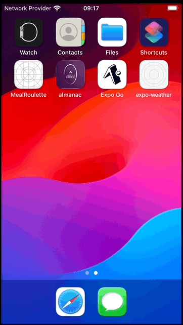

# Expo React Native Weather Application

## Table of Contents

- [Introduction](#introduction)
- [Screen recording](#screen-recording)
- [Why Expo?](#why-expo)
- [File-Based Routing with Expo Router](#file-based-routing-with-expo-router)
- [Installation](#installation)


## Introduction

Welcome to Expo-Weather App! This Expo React Native application brings you precise and up-to-date weather information. With a simple interface, Expo-Weather App offers the following features:

- **Search Location**: Easily find the weather for any location worldwide.
- **Current Weather and 5-Day Forecast**: Get real-time weather updates and a detailed 5-day forecast.
- **Save Locations**: Save your location for quick access to their weather conditions.
- **Modify Saved Locations**: Update saved location.


### Screen recording


<div style="display: flex; flex-direction: row;">
  
  
</div>

## Why Expo?

This project uses [Expo](https://expo.dev/) because it is now [recommended by React Native contributors as of the latest conference](https://www.linkedin.com/posts/sebastienlorber_reactnative-reactconf-activity-7196913015336620035-toDV?utm_source=share&utm_medium=member_desktop). Expo simplifies the development process by providing a set of tools and services that are well-integrated with React Native, ensuring a smoother and more efficient workflow.

## File-Based Routing with Expo Router

This project uses `expo-router` for navigation, leveraging file-based routing for an intuitive and organized structure. The screen files are named according to `expo-router` conventions, ensuring consistency and clarity in the project.

### Key Features of Expo Router:
- **File-Based Routing**: Each screen corresponds to a file, making navigation straightforward and maintenance easier.
- **Naming Conventions**: Screens are named following `expo-router` conventions. This means that the file names directly reflect the routes, providing a clear and predictable routing system.


## Dark and Light Mode Support

Expo Weather App supports both dark and light modes, providing an optimal viewing experience based on user preference or system settings. 

## Styling with react-native-unistyles

This project uses `react-native-unistyles` for styling, offering several benefits:

- **Unified Styling**: Provides a consistent and unified approach to styling across the app.
- **Theme Support**: Easily switch between dark and light themes, ensuring a seamless and cohesive user experience.
- **Improved Maintainability**: Simplifies style management, making it easier to maintain and scale the app.

With `react-native-unistyles`, WeatherApp delivers a polished and adaptable user interface that enhances usability and aesthetic appeal.

## Installation

### Prerequisites

- Node.js
- Expo CLI

### Steps

1. Clone the repository:

   ```bash
   git clone git@github.com:YahiaJabeur/expo-weather.git
   cd expo-weather

2. Install dependencies:

   ```bash
   npm install

3. Run iOS App:
   ```bash
   npx expo run:ios

4. Run Android App:
   ```bash
   npx expo run:android

